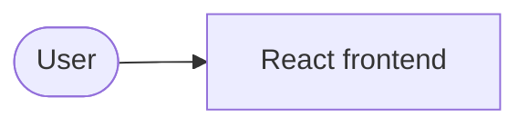

# cgpe-android

> A TypeScript frontend app built with React.


## Why this exists

This repository ships without a description — everything below was detected from its files. The codebase is written primarily in TypeScript and JavaScript. It is built on React.

## Tech stack

| Technology | Role | How it's used |
| --- | --- | --- |
| TypeScript | Language | 100% of the code by bytes (GitHub language stats) |
| React | Framework | react in package.json |
| Playwright | Testing | @playwright/test in package.json |
| Vitest | Testing | vitest in package.json |
| ESLint | Tooling | eslint in package.json |

## Architecture

React renders the frontend.



## Getting started

```bash
git clone https://github.com/AazikoGlobalLLP/cgpe-android.git
cd cgpe-android
npm install
npm run start
npm run test
```

Every command above exists in the repository:

- `npm install` — install JavaScript dependencies (package.json present)
- `npm run start` — package.json "start" script: expo start
- `npm run test` — package.json "test" script: vitest run

## Project structure

```text
cgpe-android/
├── assets/   # static assets
├── docs/     # documentation
├── e2e/      # end-to-end tests
├── public/   # static assets
├── scripts/  # automation scripts
├── src/      # application source code
└── test/     # test suite
```

## CI & testing

Detected test tooling:

- Playwright — @playwright/test in package.json
- Vitest — vitest in package.json

## License

MIT — as declared in the repository's GitHub license metadata.

---

_README forged from the repository itself by ProfileForge (https://profileforge-one.vercel.app/project) — every claim above was detected, not guessed._
